# Итоговая работа по дисциплине «ETL-процессы» (Модуль 4)

**Студент:** Жигулев Глеб

## Задание 1. Работа с Yandex DataTransfer

### 1.1. Создание базы данных YDB

Создана serverless-база Yandex Database.

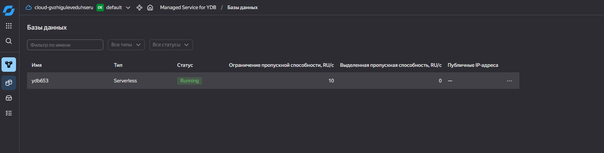

### 1.2. Подготовка данных

В качестве источника подготовлен датасет `transactions_v2.csv` (~43 МБ, 400 000 строк).
К данным добавлен синтетический первичный ключ `id`, имена колонок приведены к нижнему регистру.

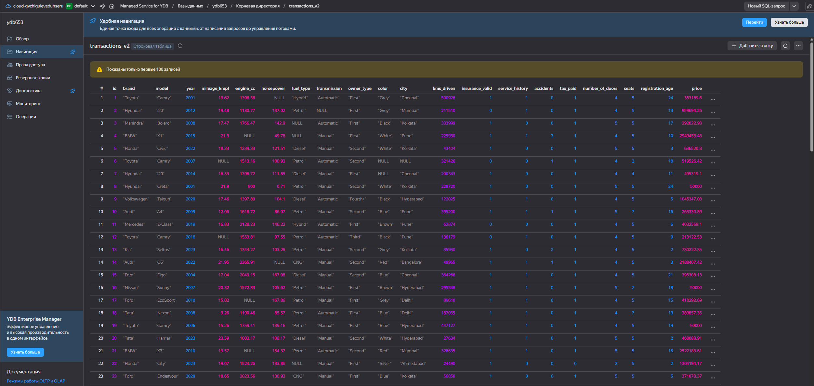

### 1.3. Создание таблицы (YQL)

```sql
CREATE TABLE transactions_v2 (
    id                Uint64,
    brand             Utf8,
    model             Utf8,
    year              Int32,
    mileage_kmpl      Double,
    engine_cc         Double,
    horsepower        Double,
    fuel_type         Utf8,
    transmission      Utf8,
    owner_type        Utf8,
    color             Utf8,
    city              Utf8,
    kms_driven        Uint64,
    insurance_valid   Int32,
    service_history   Int32,
    accidents         Int32,
    tax_paid          Int32,
    number_of_doors   Int32,
    seats             Int32,
    registration_age  Int32,
    price             Double,
    PRIMARY KEY (id)
);
```

### 1.4. Загрузка данных в YDB

Данные загружены в таблицу через YDB CLI. Команда импорта:

```bash
ydb import file csv -p transactions_v2 --header --null-value "" transactions_v2.csv
```


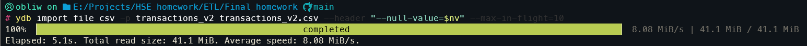

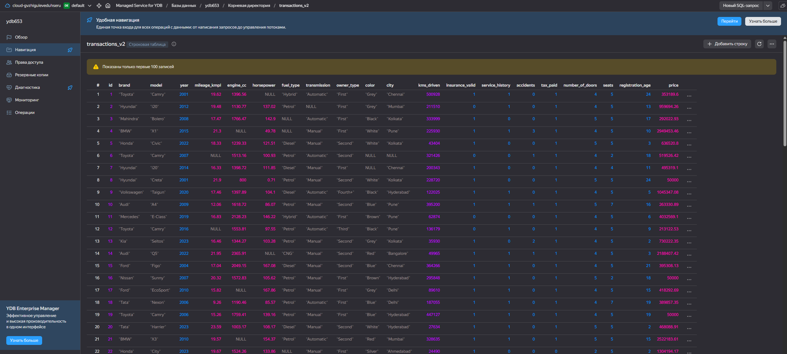


### 1.5. Создание трансфера в Object Storage

Созданы эндпоинты «источник» (YDB) и «приёмник» (Object Storage), между ними настроен трансфер.

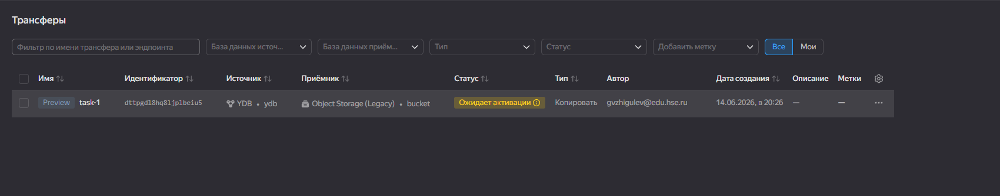

### 1.6. Проверка работоспособности трансфера

После активации трансфера данные выгружены в бакет Object Storage.

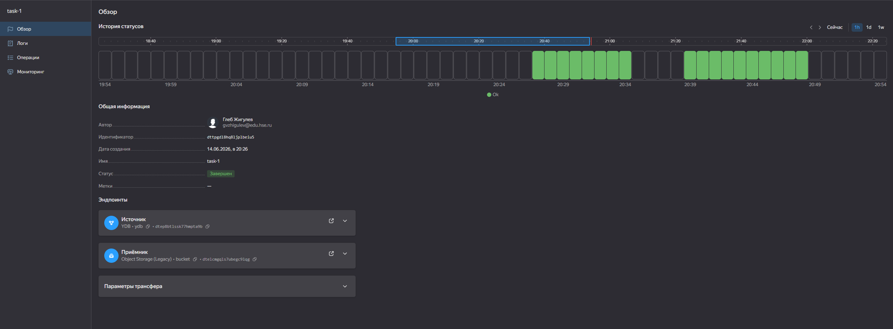

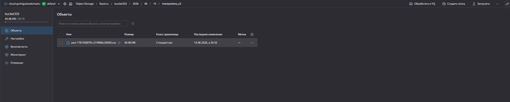

---

## Задание 2. Автоматизация Yandex Data Processing с помощью Apache Airflow


### 2.1. Подготовка инфраструктуры

Созданы бакеты Object Storage для исходных данных (`applications.csv`, ~69 МБ), PySpark-скрипта
(`process_applications.py`), результатов (`/result`) и логов кластера. Подготовлены сеть с подсетью
(с NAT-шлюзом для выхода в интернет), сервисный аккаунт с ролями `dataproc.agent`, `dataproc.editor`,
`vpc.user`, `storage.editor`, `iam.serviceAccounts.user`, `managed-airflow.integrationProvider`.

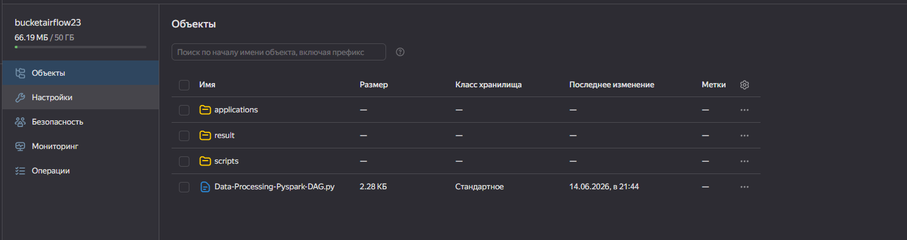

### 2.2. Кластер Managed Service for Apache Airflow

Создан кластер Airflow, в настройках указан бакет-источник DAG-файлов.

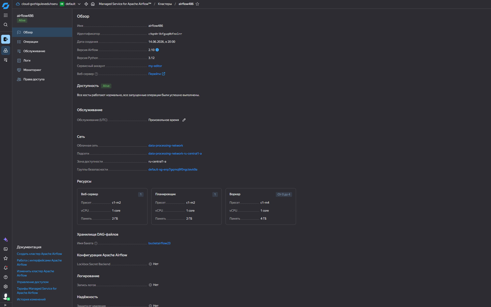

### 2.3. PySpark-задание

Скрипт `process_applications.py` читает CSV с кредитными заявками из Object Storage, строит три
витрины (воронка решений по регионам и продуктам, динамика по дням, распределение по уровню риска
и каналу) и пишет результат в Parquet.

### 2.4. DAG

DAG `data_processing_pyspark` выполняет три шага: создание временного кластера Data Processing →
запуск PySpark-задания → удаление кластера (`trigger_rule="all_done"` гарантирует удаление кластера
даже при сбое задания).

```python
create_cluster >> run_pyspark >> delete_cluster
```

### 2.5. Проверка работоспособности DAG

DAG успешно отработал: кластер создан, задание выполнено, кластер удалён.

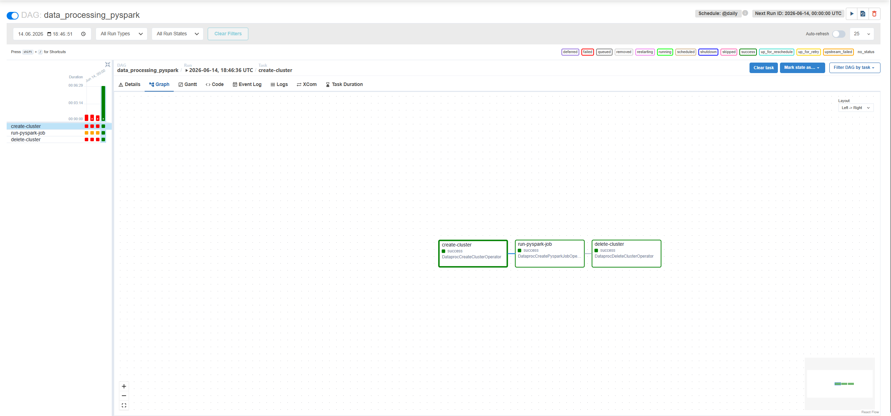

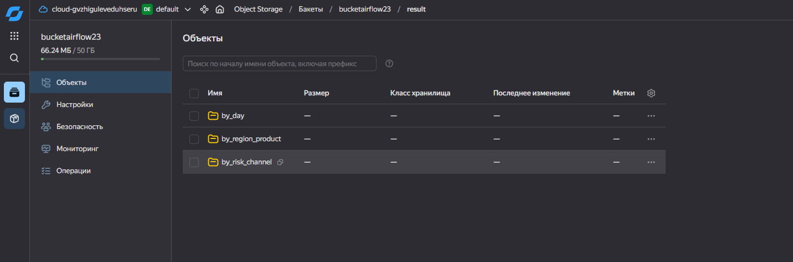

---

## Задание 4. Визуализация в DataLens


В качестве источника использованы данные из задания 1 (таблица `transactions_v2` в YDB).
Создано подключение к YDB, на его основе — датасет, по датасету построены чарты и собран дашборд.

### 4.1. Средняя цена по маркам

Тип «Столбчатая»; X = `brand`, Y = `avg(price)`.

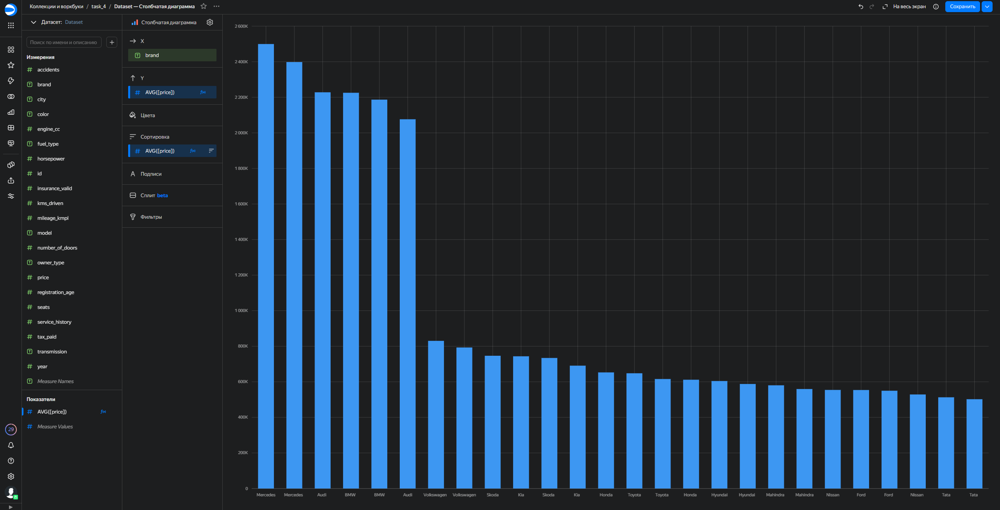

### 4.2. Цена в зависимости от года

Тип «Линейная»; X = `year`, Y = `avg(price)`.

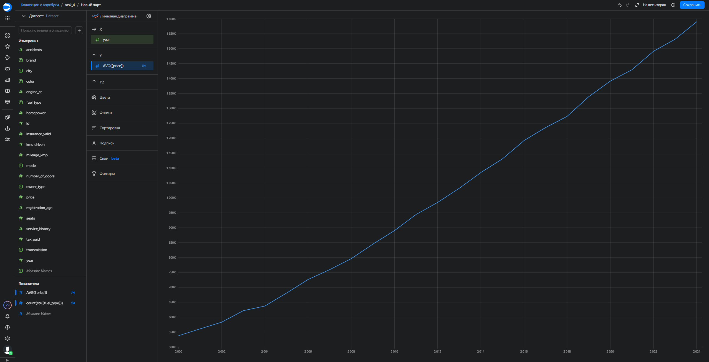

### 4.3. Дашборд

Чарты объединены в дашборд с селекторами для интерактивной фильтрации.

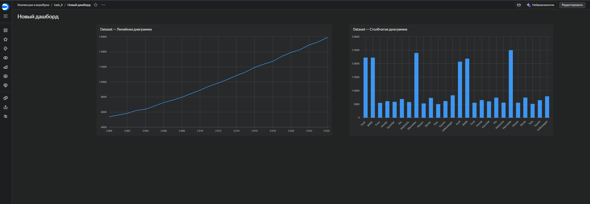

---

## Структура репозитория

```
.
├── Отчет.md                           # отчёт
├── data/
│   ├── transactions_v2.csv            # данные для задания 1
│   └── applications.csv               # данные для задания 2
├── create_table_transactions.sql      # YQL-скрипт создания таблицы (задание 1)
├── Data-Processing-Pyspark-DAG.py     # DAG (задание 2)
├── process_applications.py            # PySpark-задание (задание 2)
└── images/                            # скриншоты для отчёта
```
