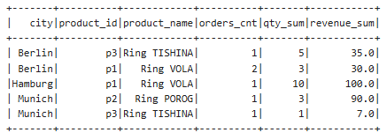

# mart_city_top_products

## 📌 Описание

Проект реализует витрину данных `mart_city_top_products` в Apache Spark.

Цель — определить **Top-2 товара в каждом городе по суммарной выручке (revenue)**.

---

## Структура проекта

```
mart_city_top_products/
│
├── README.md
│
├── notebooks/
│   └── mart_city_top_products.zpln
│
└── src/
    └── mart_city_top_products.py
```

**mart_city_top_products.zpln** — экспорт ноутбука из Apache Zeppelin
  (содержит весь код и результаты выполнения ячеек)

**mart_city_top_products.py** — копия кода из ноутбука, оформленная как Python-скрипт
  (используется для запуска как Spark job)


---

## Исходные данные

В проекте используются три набора данных:

* **users** — пользователи и их города
* **orders** — заказы
* **products** — справочник товаров

Данные создаются прямо в Spark (в Zeppelin).

---

## Логика расчёта

1. Рассчитывается выручка:

   ```
   revenue = qty * price
   ```

2. Выполняется объединение таблиц:

   * orders + users
   * orders + products

3. Рассчитываются метрики по `(city, product_id, product_name)`:

   * `orders_cnt` — количество заказов
   * `qty_sum` — суммарное количество
   * `revenue_sum` — суммарная выручка

4. С помощью Window-функции выбираются **Top-2 товара в каждом городе**:

   ```
   row_number() over (partition by city order by revenue_sum desc)
   ```

---

## Сохранение результата

Результат сохраняется в формате Parquet:

```
/tmp/sandbox_zeppelin/mart_city_top_products/
```

Режим записи: `overwrite`

---

## Результат

Результата:



---

